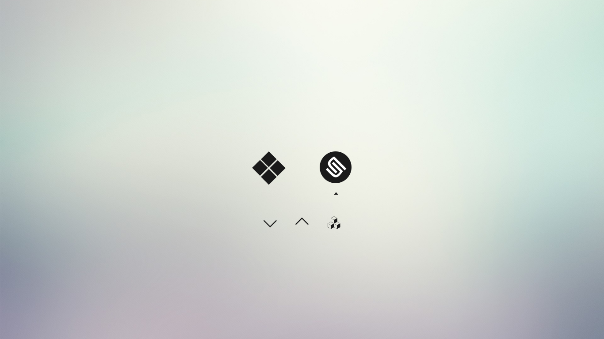

## Minimalistic rEFInd theme

[rEFInd](http://www.rodsbooks.com/refind/) is a simplistic boot manager for UEFI
based systems. This is a clean and minimal theme (dark variant) for it forked from [EvanPurkhiser's theme](https://github.com/EvanPurkhiser/rEFInd-minimal).




### Usage

 1. Locate your refind EFI directory. This is commonly `/boot/EFI/refind`
    though it will depend on where you mount your ESP and where rEFInd is
    installed. `fdisk -l` and `mount` may help.

 2. Create a folder called `themes` inside it, if it doesn't already exist

 3. Clone this repository into the `themes` directory.

 4. To enable the theme add `include themes/rEFInd-minimal/theme.conf` at the end of
    `refind.conf`. For the dark theme, use `include themes/rEFInd-minimal/theme_dark.conf`.

Here's an example menuentry configuration (from the screenshot)

```nginx
menuentry "Windows 10" {
	icon /EFI/refind/themes/rEFInd-minimal/icons/os_win.png
	loader /EFI/Microsoft/Boot/bootmgfw.efi
}

menuentry "Ubuntu GNOME 16.04.1 LTS" {
	icon /EFI/refind/themes/rEFInd-minimal/icons/os_ubuntugnome.png
	volume "2ea3ea21-dec5-4bb4-a1a9-e7d3a857904c"
	loader /vmlinuz.efi.signed
	initrd /initrd.img
	options "root=PARTUUID=2ea3ea21-dec5-4bb4-a1a9-e7d3a857904c ro quiet splash"
	submenuentry "older kernel" {
		volume "2ea3ea21-dec5-4bb4-a1a9-e7d3a857904c"
		loader /vmlinuz.old.efi.signed
		initrd /initrd.img.old
	}
	submenuentry "GRUB" {
		volume "c95d1e6c-339c-4dd4-b08d-9067e783cbb0"
		loader /EFI/ubuntu/grubx64.efi
		initrd
		options
	}
	submenuentry "to single user mode" {
		volume "2ea3ea21-dec5-4bb4-a1a9-e7d3a857904c"
		loader /vmlinuz.efi.signed
		initrd /initrd.img
		options "root=PARTUUID=2ea3ea21-dec5-4bb4-a1a9-e7d3a857904c ro quiet splash single"
	}
	submenuentry "to recovery mode" {
		volume "2ea3ea21-dec5-4bb4-a1a9-e7d3a857904c"
		loader /vmlinuz.efi.signed
		initrd /initrd.img
		options "root=PARTUUID=2ea3ea21-dec5-4bb4-a1a9-e7d3a857904c rw recovery nomodeset"
	}
}
```

Entries that are autodetected should also show the proper icons.

### Background sizes

If you find the background looks blurry it may be due to the included wallpaper
being an incorrect resolution for your monitor. You can download the [original
high quality wallpaper][wallpaper], resize it as appropriate, and replace the
`background.png`.

You can of course also choose your own background!

### Attribution

The OS icons are from [Lightness for burg][icons] by [SWOriginal][icon-author].

The background is [Minimalist Wallpaper][wallpaper] by
[LeonardoAIanB][wallpaper-author]. Thank you to [Padster][padster] for locating
it!

[icons]: http://sworiginal.deviantart.com/art/Lightness-for-burg-181461810
[icon-author]: http://sworiginal.deviantart.com/

[padster]: https://github.com/theRealPadster
[wallpaper]: http://leonardoalanb.deviantart.com/art/Minimalist-wallpaper-295519786
[wallpaper-author]: http://leonardoalanb.deviantart.com/
